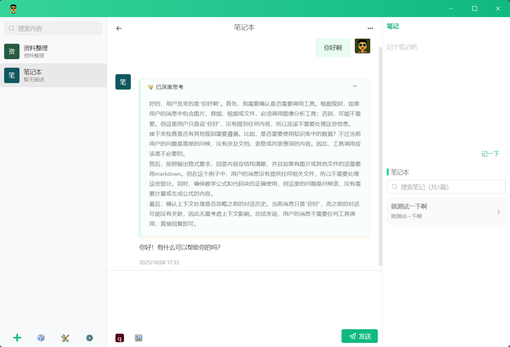

# 小飞树知识库

小飞树知识库是一个基于Tauri开发的完全本地化的知识库客户端。

有以下功能：

- 支持MD、TXT、WORD、EXCEL、PPT、PDF等格式文件导入到知识库
- 支持识别图片和扫描版的PDF（使用内置的OCR或接入视觉模型）
- 内置向量库，按固定文本数拆分文本，支持重排序。
- 支持主流模型及兼容OpenAI规范的模型，内置Qwen3系列文本模型，可直接下载后本地运行。
- 支持兼容MCP协议规范的工具，内置图片问答和网页搜索工具，一键安装即可使用。
- AI记忆功能，切换不同模型仍能保持个人特征。这些特征在本地加密存储，无需上传。

# 开发启动

```shell
npm run tauri dev
```

# 打包

```shell
./build-script/package.sh 0.1.1
```

# 下载

下载页面：[小飞树知识库](https://xfs.coderbox.cn)

目前仅支持windows，其他平台需自行编译。


# 部分截图



